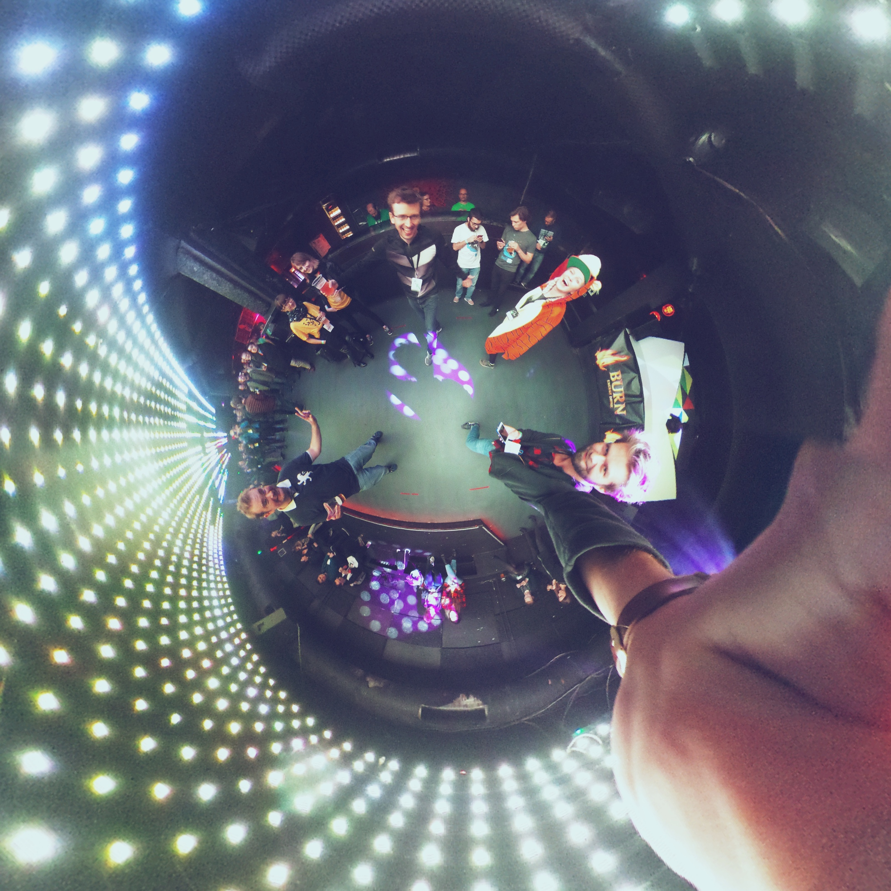

# JSConf Budapest 2017

LiveJS did a audio + visual + light performance for the after-party of [JSConf Budapest](http://jsconfbp.com/).

* Where? [Corvin Club](http://corvinclub.hu/index.php/en/), Budapest, Hungary
* When? 26th of October 2017, 08:30pm until 10:00pm

## Artists

* [Ruth John](https://twitter.com/Rumyra): Visuals provided by [Vizra](https://github.com/livejs/Vizra)
* [Sam Wray](https://twitter.com/_2xAA): Chiptune played with two Game Boy Advance
* [Martin Schuhfuss](https://twitter.com/usefulthink): Lights controlled by dmxpen
* [Tim Pietrusky](https://twitter.com/TimPietrusky): Lights controlled by dmxpen

## Images

You can [find all pictures in our album](https://photos.app.goo.gl/Sg9A4tKQNB0eURY62). 

### Credits

* Plantes by [Stefan Judis](https://twitter.com/stefanjudis)

## Videos

## Tweets

* https://twitter.com/jsconfbp/status/923624871434899457
* https://twitter.com/jsconfbp/status/923622936132620288
* https://twitter.com/jsconfbp/status/923602843453591552
* https://twitter.com/usefulthink/status/923538403743928321
* https://twitter.com/TimPietrusky/status/923549737554513920

## Thank you

* [Szabolcs Toth](https://twitter.com/_Nec) for inviting us to JSConf Budapest and helping us with everything we needed
* [Feli](https://github.com/kotzendekrabbe) for managing flights, accommodation and everything inbetween
* [SinnerSchrader](https://sinnerschrader.com/) for sponsoring flights and accomodation

## Sponsor

This performance was sponsored by [SinnerSchrader](https://sinnerschrader.com/), because [Feli](https://github.com/kotzendekrabbe) and [Tim](https://twitter.com/TimPietrusky) thought that it's a good idea to bring LiveJS to JSConf Budapest to spread the love for the Web. 

## Something missing?

* A picture of LiveJS?
* A video of LiveJS?
* Something else of LiveJS?

Please send it to we@livejs.network or tweet [@LiveJS_network](https://twitter.com/livejs_network or PR
